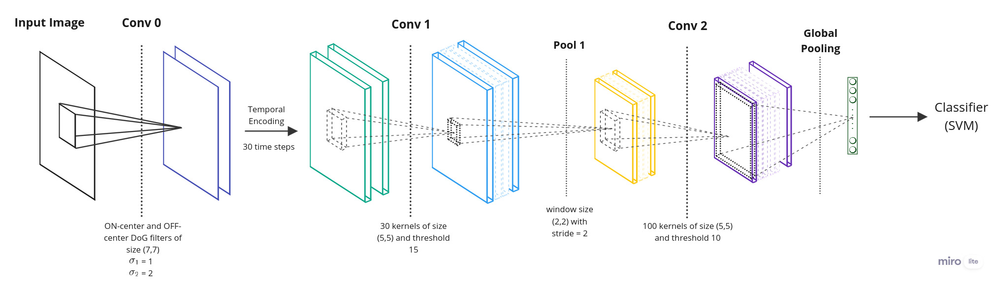
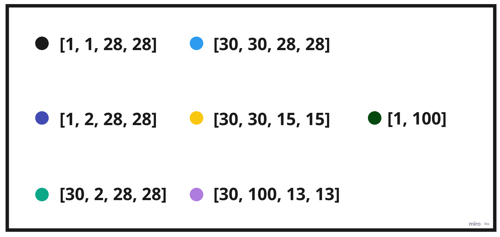
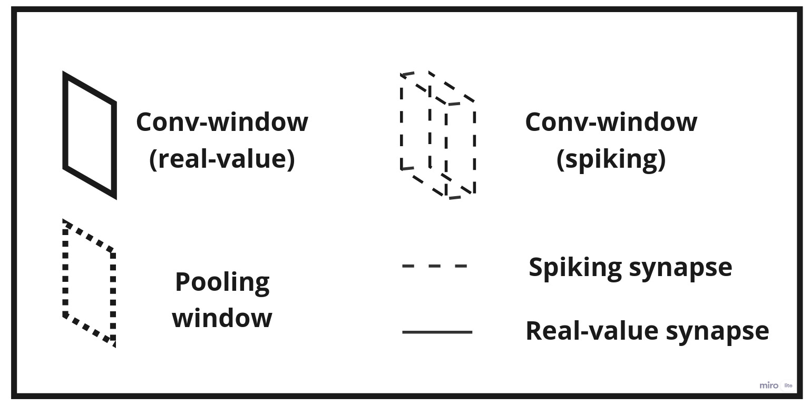
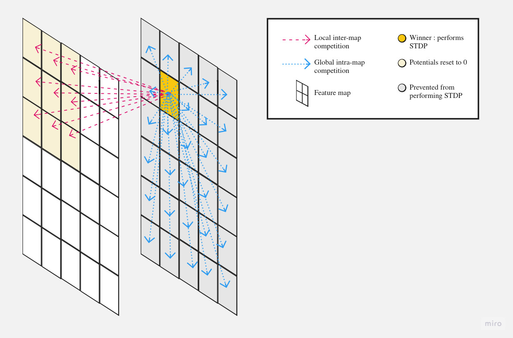

# **Summary of STDP-based spiking deep convolutional neural networks for object recognition** 

In the paper "STDP-based spiking deep convolutional neural networks for object recognition", the authors present an unsupervised approach to training a spiking deep convolutional neural network (DCNN) for object recognition. The [architecture] consists of a Difference of Gaussians (DoG) filtering layer, followed by a temporal encoding step, two convolutional layers, a local pooling layer and a global pooling layer that's directly fed into a classifier. The neurons used in the paper are non-leaky integrate-and-fire neurons (IF).

| Architecture proposed in *STDP-based spiking deep convolutional neural networks for object recognition* |
| :---: | :---: |
|  |

| Tensor shapes of the layers | Details of the architecture |
| :---: | :---: |
|  |  |

The DoG filtering layer applies a filter that's sensitive to positive contrast (ON-center map) and negative contrast (OFF-center map). It approximates the center-surround properties of the ganglion cells of the retina, allowing the network to detect visual features in a way that's similar to the human visual system.

In the convolutional layer, neurons in the same map [compete] with each other to perform Spike-Timing Dependent Plasticity (STDP). After applying a basic convolution, the first neuron that reaches the threshold and fires is the winner, triggering the STDP and updating the synaptic weights. The winner imposes its updated weights onto the rest of the neurons in its map, preventing them from learning through global intra-map competition. It also prevents neurons in other maps within a small neighborhood around its location from doing the STDP, further limiting the number of neurons that detect a single feature.

| Global intra-map competition and Local inter-map competition |
| :---: | :---: |
|  |

Local inter-map competition encourages the neurons of different maps to learn different features. Additionally, there can be at most one spike at each location, indicating the existence of a particular visual feature in that location. In this paper, max pooling is applied for local pooling, where the considered neuron in a window span is the neuron that fired the earliest.

The global pooling layer takes only the max value per neuronal map, reducing the number of outputs that are fed into the classifier.

Since the network is trained in an unsupervised way, the authors train a classic classifier with multi-class classification loss functions, such as log loss.

For every winner in the network, an STDP is triggered to update the values of the weights. The update is done following a [specific rule] with learning rates, and the choice of the initial values of the learning rates is crucial for the network's performance. If the learning rates are too large, the network's learning memory will decrease, while too small learning rates will slow down the learning process. It is also important to choose learning rates such that the neurons are capable of firing and learn one pattern, but not fire for all of them.

$$
\Delta\omega_{ij}=\left\{ \begin{array}{ll} a^+\omega_{ij}(1-\omega_{ij}) , \quad \quad if \quad t_j-t_i \leqslant 0 \\ \\ a^- \omega_{ij}(1-\omega_{ij}), \quad \quad if \quad t_j - t_i \gt 0\end{array} \right.
$$

with :                       $a^+ , a^- :$  learning rates
